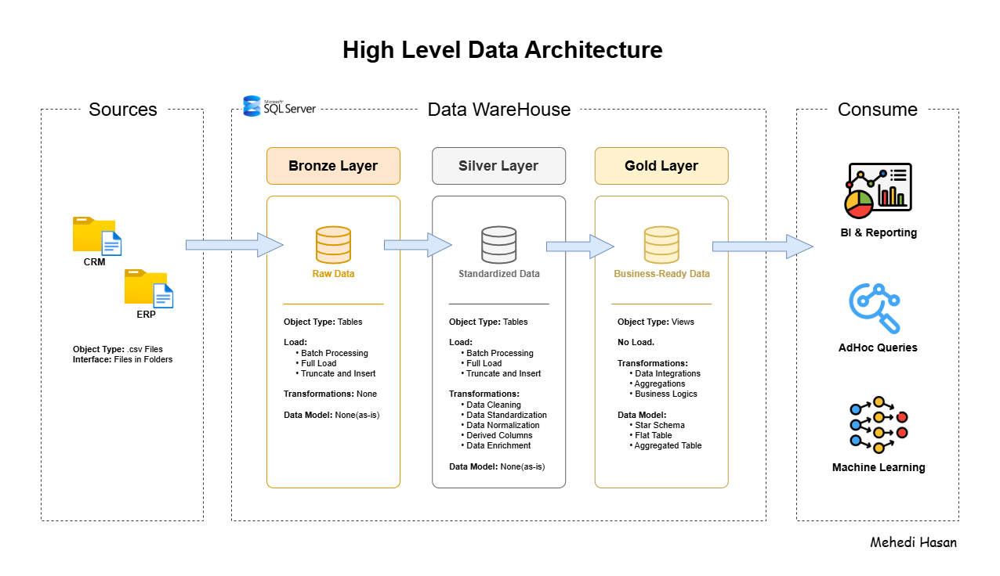

# Data Warehouse and Analytics Project

Welcome to the **Data Warehouse and Analytics Project** repository! 🚀
This project demonstrates an end-to-end data warehousing and analytics solution—from building a modern data warehouse to generating actionable insights. Designed as a portfolio project, it highlights industry best practices in data engineering and analytics.

---

## 🏗️ Data Architecture

The data architecture for this project follows the Medallion Architecture with **Bronze**, **Silver**, and **Gold** layers:



1. **Bronze Layer**: Stores raw data ingested *as-is* from source systems. Data is loaded from CSV files into a SQL Server database.
2. **Silver Layer**: Performs data cleansing, standardization, and normalization to prepare data for analysis.
3. **Gold Layer**: Contains business-ready data modeled into a star schema for reporting and analytics.

---

## 📖 Project Overview

This project includes:

1. **Data Architecture**: Designing a modern data warehouse using the Medallion Architecture (**Bronze**, **Silver**, and **Gold** layers).
2. **ETL Pipelines**: Extracting, transforming, and loading data from source systems into the data warehouse.
3. **Data Modeling**: Developing fact and dimension tables optimized for analytical queries.
4. **Analytics & Reporting**: Creating SQL-based reports and dashboards to deliver actionable insights.

🎯 This repository is ideal for professionals and students who want to demonstrate skills in:

* SQL Development
* Data Architecture
* Data Engineering
* ETL Pipeline Development
* Data Modeling
* Data Analytics

---

## 🛠️ Tools & Resources

All tools listed below are **free to use**:

* **[Datasets](Datasets/)**: Project datasets (CSV files).
* **[SQL Server Express](https://www.microsoft.com/en-us/sql-server/sql-server-downloads)**: Lightweight SQL Server edition for hosting the database.
* **[SQL Server Management Studio (SSMS)](https://learn.microsoft.com/en-us/sql/ssms/download-sql-server-management-studio-ssms?view=sql-server-ver16)**: Graphical interface for managing SQL Server databases.
* **[GitHub](https://github.com/)**: Version control and collaboration platform.
* **[Draw.io](https://www.drawio.com/)**: Tool for designing data architectures, models, and workflows.
* **[Notion](https://www.notion.com/)**: Project documentation and task management.
* **[Notion Project Steps](https://solar-mist-741.notion.site/Data-Warehouse-Project-2c82f9f58e8480f09e8fe36d7bf861d2)**: Detailed project phases and tasks.

---

## 🚀 Project Requirements

### Building the Data Warehouse (Data Engineering)

#### Objective

Develop a modern data warehouse using SQL Server to consolidate sales data and enable analytical reporting for informed decision-making.

#### Specifications

* **Data Sources**: Import data from two source systems (ERP and CRM) provided as CSV files.
* **Data Quality**: Identify, cleanse, and resolve data quality issues before analysis.
* **Integration**: Combine both sources into a single, user-friendly data model optimized for analytical queries.
* **Scope**: Focus on the latest dataset only; historical tracking is out of scope.
* **Documentation**: Provide clear and concise documentation of the data model for business and analytics teams.

---

### BI: Analytics & Reporting (Data Analysis)

#### Objective

Develop SQL-based analytics to deliver insights into:

* **Customer Behavior**
* **Product Performance**
* **Sales Trends**

These insights empower stakeholders with key business metrics to support strategic decision-making.

---

## 📂 Repository Structure

```
data-warehouse-project/
│
├── Datasets/                           # Raw ERP and CRM datasets
│ 
├── Docs/                               # Documentation and architecture artifacts
│   ├── DataArchitecture.png            # Overall system architecture
│   ├── DataCatalog.md                  # Dataset catalog with metadata and field descriptions
│   ├── DataFlow.png                    # Data flow diagrams
│   ├── DataIntegration.png             # Documentation of relations between tables
│   ├── DataModels.png                  # Star schema data models
│   └── NamingConventions.md            # Naming standards for tables, columns, and files
│
├── Scripts/                            # SQL scripts for ETL and transformations
│   ├── Bronze/                         # Raw data ingestion scripts
│   ├── Silver/                         # Data cleansing and transformation scripts
│   └── Gold/                           # Analytical model scripts
│
├── Tests/                              # Data quality and validation tests
│
├── Analysis/                           # Analytical scripts and Business insights
│   ├── A.Exploratory Analysis/         # Data profiling, dimension auditing, and KPI discovery
│   ├── B.Descriptive Analysis/         # Trend analysis, performance benchmarking, and segmentation
│   └── C.Reporting/                    # Production-ready Customer, Product, and Sales insights
│
├── README.md                           # Project overview and setup instructions
├── LICENSE                             # License information
└── .gitignore                          # Git ignore rules
```

---

## 🛡️ License

This project is licensed under the [MIT License](LICENSE). You are free to use, modify, and distribute it with proper attribution.

---

## 🌟 About Me

Hi! I’m **Mehedi Hasan**, well known as **Mehedi Bhai**, a Certified Data Analyst with strong proficiency in *Excel*, *Power BI*, and *SQL*. I specialize in data visualization, transforming raw data into clear, meaningful insights that help businesses make impactful data-driven decisions.

Let’s connect:

[](https://www.linkedin.com/in/mehedi-hasan-b3370130a/)
[](https://youtube.com/@mehedibro101?si=huk7eZ05dOwHTs1-)
